# Herexamen webtechnologie - 24-25 augustus 2025

Bekijk, voor je begint, zeker de [toetsafspraken](.assetsoetsafspraken.pdf).

## HTML

### 1. Tabellen [3pt]

Werk in de map `./1-tabellen`.

Je werkt aan de website van een internationale luchthaven. Je krijgt de opdracht om een vluchtoverzicht weer te geven in de vorm van een HTML-tabel. De tabel moet duidelijk gestructureerd zijn, zodat bezoekers snel en overzichtelijk de informatie kunnen raadplegen.

Gebruik onderstaande vluchtgegevens om de tabel op te bouwen:

| Vluchtnummer | Maatschappij    | Bestemming      | Vertrek | Aankomst | Gate | Status    |
| ------------ | --------------- | --------------- | ------- | -------- | ---- | --------- |
| BA123        | British Airways | New York (JFK)  | 08:30   | 11:15    | A12  | On Time   |
| DL456        | Delta Airlines  | New York (JFK)  | 10:00   | 12:45    | B7   | Delayed   |
| AF789        | Air France      | Paris (CDG)     | 09:15   | 11:30    | C3   | On Time   |
| LH234        | Lufthansa       | Frankfurt (FRA) | 12:00   | 14:10    | D1   | Cancelled |

Aan jou om deze gegevens correct weer te geven in HTML, met als doel een nette en toegankelijke tabel als volgt:

<figure>
  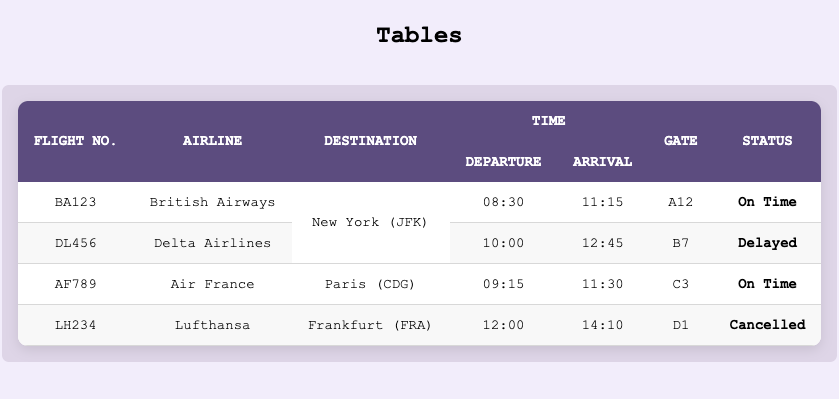
  <figcaption>Het eindresultaat</figcaption>
</figure>

Zorg bij het opbouwen van de tabel voor het volgende:

- Gebruik de juiste HTML-elementen om een semantisch correcte tabelstructuur te maken, inclusief kolomtitels.
- De kop "Time" moet worden opgesplitst in twee subkoppen: "Departure" en "Arrival".
- Zorg ervoor dat gegevens die herhaald worden, zoals de bestemming "New York (JFK)", niet dubbel worden weergegeven. Combineer deze waar nodig in de structuur van de tabel.
- Houd je aan de lay-out zoals getoond in het voorbeeld.
- Je krijgt de CSS meegeleverd, dus je hoeft je geen zorgen te maken over de opmaak van de tabel. Focus op de HTML-structuur en semantiek. Als jij de tabel correct opbouwt, zal de CSS automatisch het gewenste uiterlijk geven.

> TIP: als de opmaak niet correct is, controleer dan of je de juiste HTML-elementen hebt gebruikt en of je de structuur van de tabel goed hebt opgezet (ga eens kijken naar de CSS).

## CSS

Voor deze oefeningen mag je enkel CSS toevoegen. Laat bestaande HTML en CSS zoals ze zijn.

-----------------------------
### 2. Flexbox

Je werkt in de map `./2-flex`.

Je past enkel de CSS aan in het bestand `./2-flex/css/style.css`.

Het is niet toegestaan om:

- iets aan te passen aan de HTML of andere CSS-bestanden.
- elementen te positioneren op een andere manier dan Flexbox

Baseer je op de screenshots én de beschrijving.

#### Horizontaal verdeeld [1pt]

- Plaats de drie gekleurde `
`-elementen horizontaal naast elkaar binnen het `
`-element.
- Gebruik flexbox op de container om dit te bereiken.
- Zorg dat er ten minste 1rem afstand is tussen de items.
- Verdeel de resterende ruimte gelijkmatig tussen de flex-items, zodat de eerste en laatste box tegen de containerranden staan.

<figure>
  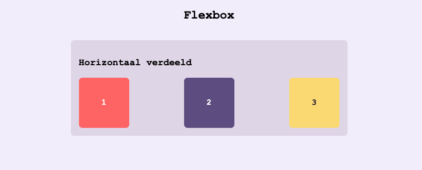
  <figcaption>Het eindresultaat op desktop</figcaption>
</figure>

<figure>
  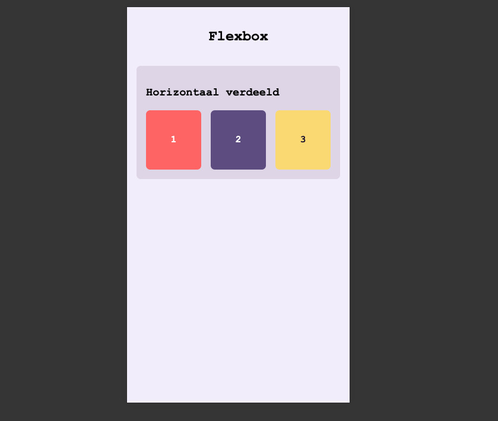
  <figcaption>Het eindresultaat op iPhone SE</figcaption>
</figure>

### 3. Oneven [1pt]

Je werkt in de map `./3-oneven`.

Je past enkel de CSS aan in het bestand `./3-oneven/css/style.css`.

- Gebruik een pseudo-selector om alle **oneven** `
`-elementen te selecteren.
- Geef ze een achtergrondkleur die opgeslagen zit in de variabele `--achtergrond-1`, en een tekstkleur die opgeslagen zit in de variabele `--tekst-1`.

<figure>
  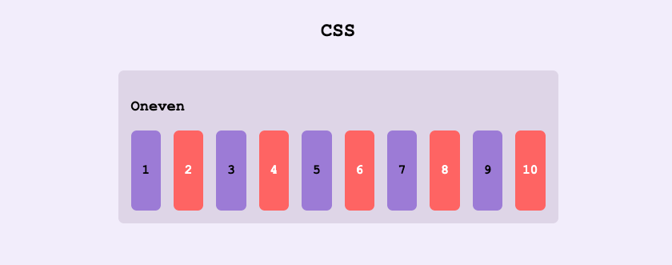
  <figcaption>Het eindresultaat</figcaption>
</figure>

### 4. Responsive

Je werkt in de map `./4-responsive`.

#### Persoonsfiche [3pt]

Je krijgt een HTML en CSS-bestand met een persoonsfiche. De fiche is al geoptimaliseerd voor mobiele apparaten.

Maak de fiche volledig responsive door mobile-first te werken en één of meerdere media queries toe te voegen met een breakpoint van 600px.

**Card**

Op schermen van 600px of groter:
- Stel de achtergrondafbeelding in op employee-desktop.jpg.
- Gebruik flexbox om de witte text-box correct te positioneren.
- Verwijder de witte rand binnen de card.

**Text-box**

Op schermen van 600px of groter:
- Laat de text-box de volledige hoogte van de card innemen.
- Beperk de breedte van de text-box tot 45% van de card.

##### Screenshots

<figure>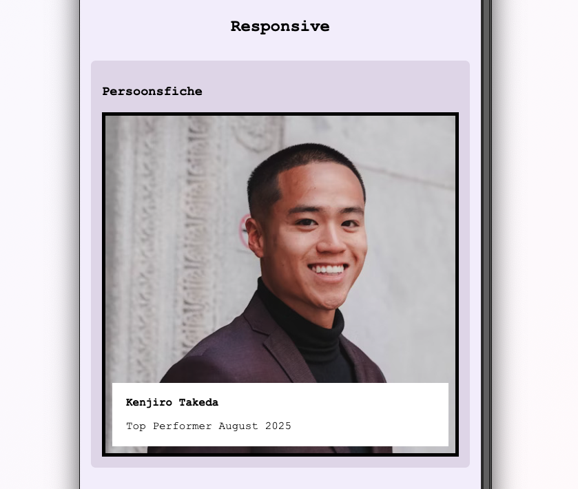<figcaption>Schermen smaller dan 600px</figcaption></figure>
<figure>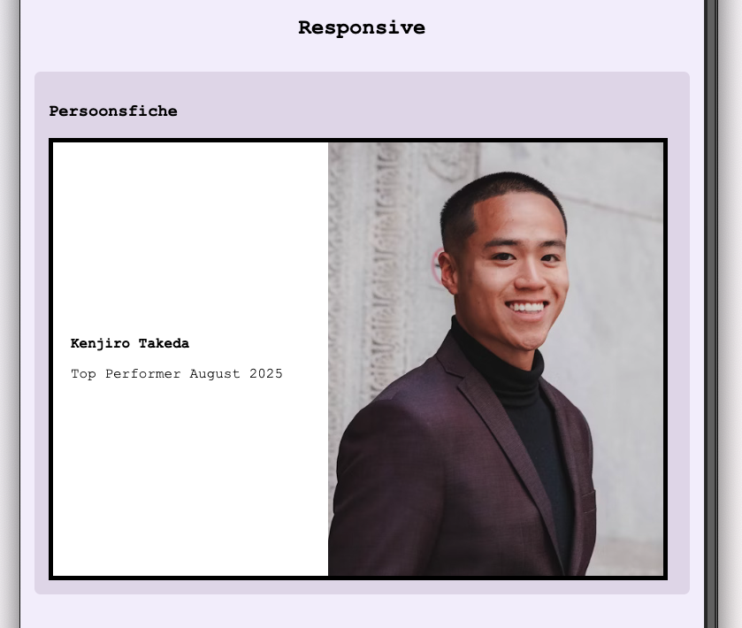<figcaption>Schermen breder of gelijk aan 600px</figcaption></figure>

### 5. Zweven [1pt]

Je werkt in de map `.5-zweven`.

Je past enkel de CSS aan in het bestand `./5-zweven/css/style.css`.

- Schrijf een pseudo-selector om `
`-elementen te selecteren waar je met je cursor overheen zweeft.
- Zorg ervoor dat deze elementen 20 graden om hun as in wijzerzin roteren.

<figure>
  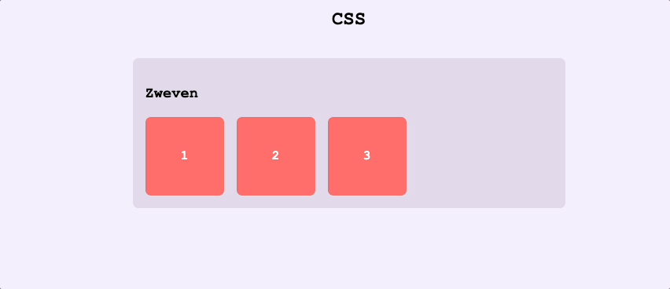
  <figcaption>Het eindresultaat</figcaption>
</figure>

### 6. Universeel [1pt]

Je werkt in de map `./6-universeel`.

Je past enkel de CSS aan in het bestand `./6-universeel/css/style.css`.

- Schrijf een selector om alle elementen binnen het `
`-element te selecteren.
- De selector moet alle huidige en toekomstige elementen binnen de container selecteren, ongeacht hun type of extra klassen.
- Geef deze elementen padding van 5px en een achtergrondkleur die opgeslagen zit in de variabele `--color-ternary` zodat je een markeer-effect krijgt.

<figure>
  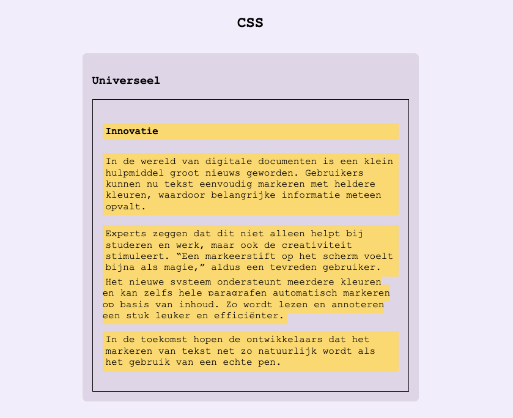
  <figcaption>Het eindresultaat</figcaption>
</figure>

### 7. Attribuut [1pt]

Je werkt in de map `./7-attribuut`.

Je past enkel de CSS aan in het bestand `./7-attribuut/css/style.css`.

- Gebruik een _attribute-selector_ om het e-mail inputveld te selecteren.
- Zorg er voor dat tekst die in dit veld wordt ingetypt wordt weergegeven in het monospace lettertype "Courier New". Voorzie een fallback naar eender welk ander monospace lettertype voor het geval "Courier New" niet beschikbaar is.

<figure>
  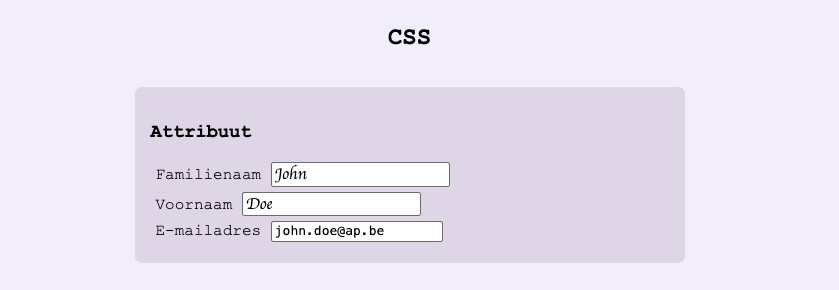
  <figcaption>Het eindresultaat</figcaption>
</figure>

### 8. Grid

Je werkt in de map `./8-grid`.

#### Structuur [5pt]

Je krijgt een HTML-bestand met een `<section class='part'>`-element met daarin zes `
`-elementen. Het is jouw taak om daarmee een grid te bouwen naar volgend voorbeeld:

<figure>
  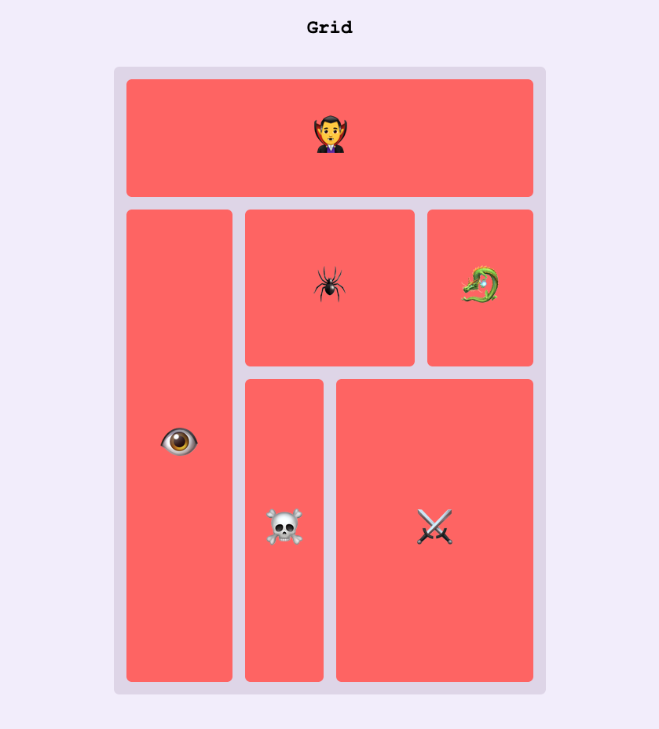
  <figcaption>Het eindresultaat</figcaption>
</figure>

**De grid-parent**

- Geef de grid-parent een vaste hoogte van 800px
- De grid-parent zal 4 kolommen en 3 rijen bevatten:

    - De tweede en derde kolom zijn elk 100px breed.
    - De eerste en vierde kolom zijn elk de helft van de resterende breedte.
    - De eerste rij is 150px hoog.
    - De tweede rij is 200px hoog.
    - De derde rij neemt de resterende hoogte in.

**De grid-children**

Voorzie de grid-children van de volgende configuratie:

- De volgorde van de grid-children je met CSS aan zodat ze in omgekeerde volgorde komen te staan van de HTML (kijk goed naar de screenshot).
- Het kind-element met inhoud "🧛‍♂️" beslaat 4 kolommen en 1 rij in het grid.
- Het kind-element met inhoud "👁️" beslaat 1 kolom en 2 rijen in het grid.
- Het kind-element met inhoud "🕷️" beslaat 1 kolom en 1 rij in het grid.
- Het kind-element met inhoud "🐉" beslaat 1 kolom en 1 rij in het grid.
- Het kind-element met inhoud "☠️"️ beslaat 1 kolom en 1 rij in het grid.
- Het kind-element met inhoud "⚔️" beslaat 2 kolommen en 1 rij in het grid.

Je kiest zelf of je met _named areas_ of _line-based_ te werk gaat (je mag extra attributen toevoegen aan de HTML).

> Tip: de `.box`-class erft zijn width en height van een andere CSS-file over. In de style.css is deze reeds overschreven naar "auto". Hier mag je niets aan veranderen.

## JavaScript

### 9. Top performers [5pt]

Je werkt in de map `./9-js`.

Je ontwikkelt een webapplicatie waarmee een coach 1 tot 2 medewerkers kan selecteren die deze maand het beste hebben gepresteerd tijdens het voetbal. De HTML- en CSS-bestanden krijg je aangeleverd; jouw taak is om de JavaScript-logica te implementeren. Wanneer een medewerker wordt aangeklikt, verschijnt er een rand om aan te geven dat hij geselecteerd is. Er mogen maximaal twee medewerkers tegelijk geselecteerd zijn.

De stappen die je volgt:

1. Maak een nieuwe JavaScript-file genaamd `top-performers.js` in de `js`-map.
2. Koppel de nieuwe `.js`-file als een module aan de HTML. Zorg dat de JS de DOM kan bereiken.
3. Selecteer alle persoonsfiches (de `div`-elementen met class `card`).
4. Maak een nieuwe array aan met de naam `selectedPersonCards`. Deze array zal de geselecteerde persoonsfiches bevatten.
5. Maak gebruik van een loop naar keuze om elke persoonsfiche een click-handler te geven. Wanneer een gebruiker op een persoonsfiche klikt:

    - Controleer of de persoonsfiche al dan niet aanwezig is in de array `selectedPersonCards` (gebruik een array-functie).
    - Indien de persoonsfiche **niet aanwezig** is in de array:

        - Voeg de persoonsfiche toe aan de array. Maak gebruik van een array-functie om dit te doen.
        - Zorg dat de class `selected` toegevoegd wordt op de betreffende persoonsfiche in de DOM.
        - Zorg dat er nooit meer dan 2 persoonsfiches geselecteerd kunnen zijn. Als de gebruiker toch probeert om een derde fiche te selecteren moet deze klik genegeerd worden.

    - Indien de persoonsfiche **wel aanwezig** is in de array:

        - Verwijder de persoonsfiche uit de array. Maak gebruik van een array-functie om dit te doen.
        - Zorg dat de class `selected` verwijderd wordt van de persoonsfiche als het al geselecteerd was.

6. Selecteer de knop.
7. Voorzie de knop van een click-handler. Als een gebruiker op de knop klikt:

    - Als de gebruiker nog geen persoonsfiche geselecteerd heeft, toon je een alert met de tekst "Selecteer minstens 1 persoonsfiche".
    - Als de gebruiker wel al minstens 1 fiche geselecteerd heeft, dan:

        - Toon een alert met de tekst "Je selectie werd bevestigd".
        - Maak de selectedPersonCards array leeg.
        - Verwijder de class `selected` van alle geselecteerde persoonsfiches.

> Opgelet: gebruik geen `onclick`-attribuut voor de click-handlers: hou je HTML en JS strikt gescheiden.

<figure>
  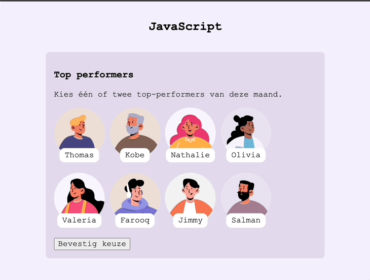
  <figcaption>Het eindresultaat</figcaption>
</figure>

### 10. Programmeertalen [5pt]

Je werkt in de map `./10-js`.

Haal een array met programmeertaal-data op met fetch. Sorteer de talen oplopend op basis van hun populariteit en toon de naam en populariteit in de DOM.

Stappen:

1. Maak een nieuwe JavaScript-file genaamd `fetch.js` in de `js`-map.
2. Koppel de nieuwe .js-file als een module aan de HTML.
3. Haal de data op van de volgende URL met behulp van fetch: `https://raw.githubusercontent.com/PhilippeSchraepen/json-host/refs/heads/main/programming-languages.json`
4. Sorteer de talen oplopend op basis van hun populariteit (popularity_rank). Maak gebruik van de **sort functie** waar je een **arrow function** aan meegeeft.
5. Selecteer de `ul`-tag met de ID `target`.
6. Creëer een nieuw `li`-element voor elk product-object uit de array. Zorg ervoor dat dit het formaat `popularity_rank - productnaam` krijgt (bv. 1 - Python).

<figure>
  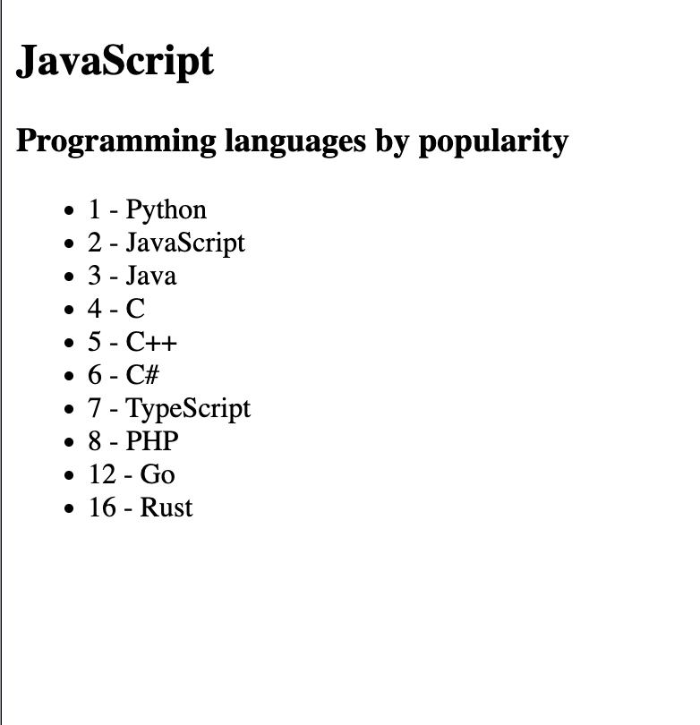
  <figcaption>Het eindresultaat</figcaption>
</figure>

> Tip: de JSON-file staat ook in de assets-folder. Mocht de GitHub-link niet werken tijdens het examen, kun je deze gebruiken.
